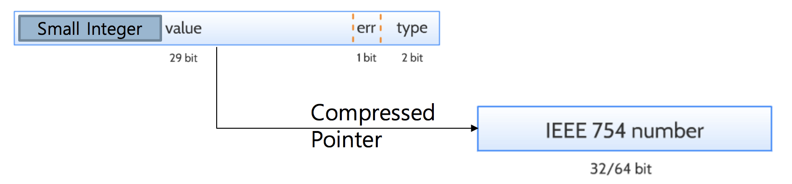
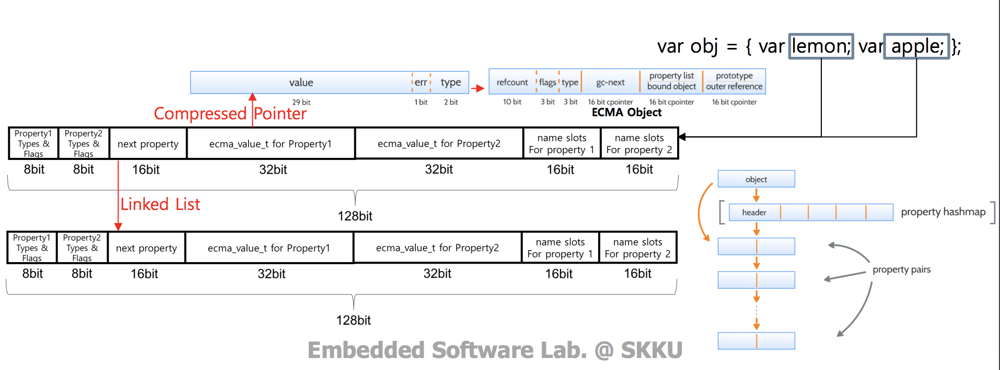

# FitbitOS JavaScript Optimization Guidelines

FitbitOS relies on [JerryScript](http://jerryscript.net/) virtual machine. JerryScript is a full-featured JS engine fully compatible with ECMA-262 edition 5.1. It is designed for microcontrollers having restricted RAM and is primarily optimized for the low memory consumption. It can operate with less than 64KB RAM, it doesn't have a JIT, and it is in general much slower than popular JS engines.
Here's [the document](https://wiki.tizen.org/images/5/52/04-JerryScript_ECMA_Internal_and_Memory_Management.pdf) describing JerryScript internals and its memory architecture.

Fitbit doesn't publish the detailed hardware specs for their devices, however, [it's known](https://toshiba.semicon-storage.com/eu/product/assp/applite/tz1200.html) that Fitbit Ionic:
- uses ARM Cortex-M4F core running at 120 MHz.
- has pretty decent hardware 2D accellerator supporting vector graphics and bitmap rotation.
- has 64KB of JS memory heap.

## There's no JIT, everything is slow

Keep in mind that in contrast to the desktop JS engines JerryScript is a pure interpreter, so optimization techniques you're probably familiar with doesn't work. Don't expect any smart optimization from the runtime, it's not smart. An every extra operation costs you performance. It might seem scary at first, but it's not that bad because the rendering pipeline is hardware accelerated and JS is used for the reaction on events from sensors and user input only.

Take this loop as an example:

    let i = 1000, x = 0;
    while( i-- ) x++;

It is about 15% faster, than this loop:

    let x = 0;
    for( let j = 0; j < 1000; j++ ) x++;

It happens because the comparison with 1000 is more expensive than the simple check that the value is truthy.

The bottom line is that nothing is free in JerryScript, but the performance is easy to predict. Carefuly review your code, remove extra operations, cache intermediate results in valiables, and do the rest of stuff people did on their Commodore 64 in 80th.

## Floating point numbers are expensive

JS Number type doesn't make a difference between integers and floats, and ECMA-262 requires the floating point to implement [64-bit IEEE math](https://en.wikipedia.org/wiki/IEEE_754). ARM Cortex-M4F has not hardware accellerated 64-bit floating point math, thus it's implemented in software and is quite slow. You can expect an execution speed to be about 4-5K of arithmetic operations per second for a Fitbit Ionic. Integer math is slightly (about 25%) faster.

There's an important difference between integers and floating point numbers in the memory consumption, however.

JerryScript operates with 32-bit values internally, and small integers which fits 29 bit (< 268,435,456) are being packed in the value directly. In contrast, the floating point number or large integer will be allocated in the heap as 64-bit float, with a value holding a pointer to it. Therefore, the floating point number takes 12 bytes, while the small integer will fit in 4.

    let a = 1; // 4 bytes
    let a = 0.5; // 12 bytes

Taking the 64KB heap size into account, the whole heap can hold about 5.5K of floating point numbers or 16K of small integers.

## Use typed arrays when possible

The problem with floating point numbers become more significant if you have to deal with number arrays. To mitigate that, JerryScript supports [JS Typed Arrays](https://developer.mozilla.org/en-US/docs/Web/JavaScript/Typed_arrays). They are array-like objects which holds unboxed numbers of the predefined type. Typed arrays operate on the preallocated memory buffer, thus you cannot resize them (no push/pop/shift/unshift methods). They, however, give you an opportunity to save memory.

If you have array of floating point numbers, consider usage of [Float32Array](https://developer.mozilla.org/en-US/docs/Web/JavaScript/Reference/Global_Objects/Float32Array). It uses three times less memory than the regular array of floats.
    
    // Regular array of floats will allocate 12KB in total
    let b = Array( 1024 ); // 4KB for the array with values
    for( let i = 0; i++; i < 1024 ) b[ i ] = i + 0.5; // + 8KB with floats

    // Just 4KB will be allocated
    let a = new Float32Array( 1024 );

If you have array of integers, consider usage of [Int16Array](https://developer.mozilla.org/en-US/docs/Web/JavaScript/Reference/Global_Objects/Int16Array) (two times less memory), [Int8Array](https://developer.mozilla.org/en-US/docs/Web/JavaScript/Reference/Global_Objects/Int8Array)(four times less memory), or their unsigned versions. [Int32Array](https://developer.mozilla.org/en-US/docs/Web/JavaScript/Reference/Global_Objects/Int32Array) has no advantage over the regular array of small integers.

## Prefer small objects

An object is represented in memory as linked list of property pairs, taking about 8 bytes per propery (plus some constant).

When the number of object properties is greater than 16, it will allocate the property hashmap in addition to the property list. Therefore, an object size is:

- ~8 bytes per property for small objects (16 members and less)
- ~10 bytes per property + some constant (~32 bytes) for large object.

Closure (lexical environment) and objects use the same internal structure, which means that there will be no difference in memory layout for these examples:

    // Object
    let o1 = { a : 1, b : 2 };

    let f1 = ( () => {
        let a = 1, b = 2;
        return () => a + b; // Will allocate an object with a shape similar to 'o1'
    })();

Thus, it's beneficial that both objects and functions will not be excessively large.

## Consider object of arrays vs array of objects

Suppose we have an array of objects of uniform shape:

    const points = [ { x : 1.5, y : 1.5 }, ... ];

An object takes 2 * 8 = 16 bytes, 64-bit floats will take another 16 giving us 32 bytes per object. So, `points` array will take 32 * N + 4 * N = 36 * N bytes.

Now lets turn the data structure inside out. It will take 24 * N + 16 bytes which is about 30% less than the previous option.

    const points = { xs : [ 1.5, ... ], ys : [ 1.5, ... };
    
Having the arrays of numbers, we can use `Float64Array`, which will give us 16 * N + 16 bytes. It's more than twice less than for the original code.

    const points = { xs : new Float64Array( N ), ys : new Float64Array( N ) };

And finally, if we switch from `Float64Array` to `Float32Array`, it will cut the size of the data structure further by half, giving us 8 * N + 16. Now our code is 4.5 times less memory hungry than the original one.

## Pack boolean flags to bitmaps

This object holding the set of boolean flags will take about 4 x 8 = 32 bytes.

    const x = {
        a : true,
        b : true,
        c : true,
        d : true
    }
    ...
    if( x.a ) doA();
    if( x.d ) doD();

    x.b = true;
    x.c = false;

The corresponding binary flas bitmap would be just an integer value taking 4 bytes. The single JerryScript value with small integer can fit up to 29 bit flags.

    let x = 0b1111;
    ...
    if( x & 0b0001 ) doA();
    if( x & 0b1000 ) doD();

    x |= 0b0100;
    x &= 0b1011;

## DO NOT: Use functions instead of hashmaps and arrays to save heap memory

The following constant defined in the application will take about 7*8 ~ 64 bytes of heap. Literal strings are being allocated in the separate literal storage during the parsing phase.

    const days = {
        "Sunday": "No School",
        "Monday": "Normal",
        "Tuesday": "Normal",
        "Wednesday": "Normal",
        "Thursday": "Normal",
        "Friday": "Normal",
        "Saturday": "No School"
    }

This code, however, completely avoids this 64 bytes allocation:

    function dayToSchedule( day ){                
        switch( day ){
            case "Sunday": return "No School";
            case "Monday": return "Normal";
            case "Tuesday": return "Normal";
            case "Wednesday": return "Normal";
            case "Thursday": return "Normal";
            case "Friday": return "Normal";
            case "Saturday": return "No School;
        }
    }

Seems to be a good idea. Right?

Nah, it's not! Surprisingly, **tests shows that the first option consumes less memory**. Second option throws out of memory exception in a situation when first option doesn't. Function's bytecode takes more memory than the preallocated object, and both the heap and the code share the same memory quote.
